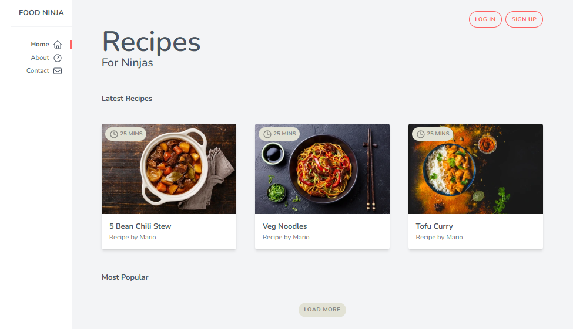
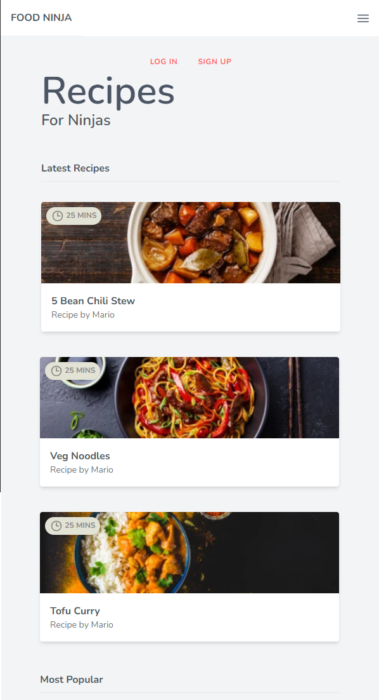

## Tailwind CSS

Tailwind CSS is a utility-first CSS framework that provides a unique approach to styling web applications. Unlike traditional CSS frameworks, Tailwind CSS doesn't come with pre-designed components or styles. Instead, it offers a set of low-level utility classes that you can use directly in your HTML markup to style elements.

### Key Features:
- **Utility-First:** Tailwind CSS promotes a utility-first approach to styling, where you apply small, single-purpose utility classes directly in your HTML. This approach offers greater flexibility and allows for rapid development.
- **Customization:** Tailwind CSS is highly customizable, allowing you to configure colors, spacing, typography, and more to match your project's design requirements. You can easily extend or override the default styles to create a unique design.
- **Responsive Design:** Tailwind CSS comes with built-in support for responsive design, making it easy to create layouts that adapt to different screen sizes and devices. You can apply responsive utility classes to control the appearance of elements across various breakpoints.
- **Performance:** Tailwind CSS generates minimal CSS output by only including the utility classes that you use in your project. This results in smaller file sizes and faster load times compared to traditional CSS frameworks.

Tailwind CSS empowers developers to create modern and responsive user interfaces with ease, making it a popular choice for building web applications.

For more information about Tailwind CSS and its features, check out the [official documentation](https://tailwindcss.com/docs/installation).


## Tailwind CSS Tutorial

In this repository, I have documented my journey learning Tailwind CSS, a utility-first CSS framework that allows for rapid development of modern and responsive web interfaces. Below is an outline of the topics covered and the corresponding tutorials:

1. **Intro & Setup**: Setting up Tailwind CSS for a new project.
2. **HTML Template**: Creating a basic HTML template for our project.
3. **Fonts & Colors**: Configuring fonts and colors using Tailwind CSS utilities.
4. **Margin, Padding & Borders**: Exploring margin, padding, and border utilities.
5. **Tailwind Config**: Understanding and customizing the Tailwind CSS configuration file.
6. **Custom Fonts**: Adding custom fonts to the project.
7. **Using Flexbox**: Leveraging Flexbox utilities in Tailwind CSS.
8. **Responsive Classes**: Utilizing responsive design with Tailwind CSS.
9. **Cards**: Creating card components using Tailwind CSS.
10. **Badges**: Implementing badges above images using absolute positioning.
11. **@apply Directive**: Using the @apply directive to create custom utility classes.
12. **Grids**: Building grid layouts with Tailwind CSS.
13. **Buttons**: Styling buttons using Tailwind CSS classes.
14. **Icons**: Integrating icons into the project with Tailwind CSS.
15. **Hover Effects**: Adding hover effects to elements using Tailwind CSS.
16. **Responsive Nav (part 1)**: Designing a responsive navigation menu (part 1).
17. **Responsive Nav (part 2)**: Enhancing the responsive navigation menu with JavaScript.
18. **Transitions**: Adding transitions to elements for smoother user interactions.
19. **Wrap Up**: Concluding remarks and final thoughts on the Tailwind CSS learning journey.

Additionally, I have included screenshots of the final website created using Tailwind CSS. Below is a code snippet for adding editable sections for these screenshots in the Markdown file:

```markdown
<!-- PC View -->


<!-- Mobile View -->


<!-- Tablet Views and Tablet View with Menu visible -->
<div style="display: flex; justify-content: space-between;">
    <!-- Tablet View -->
    
    <!-- Tablet View with Menu visible -->
    
</div>
